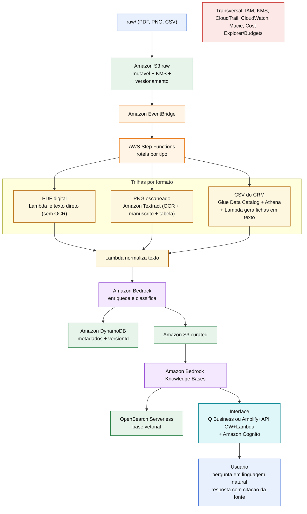

# 🧭 Wiki Corporativa Inteligente na AWS

Proposta de arquitetura que transforma um acervo bagunçado de documentos comerciais em uma base consultável em linguagem natural, usando apenas serviços da AWS.

Desafio de projeto do Bootcamp Nublify (DIO). Este repositório contém a proposta técnica completa. A implementação em uma conta AWS não foi executada: o desafio pede uma proposta bem argumentada, e é isso que está aqui. A resposta detalhada, quest por quest, está em [`resposta.md`](./resposta.md).

---

## 🎯 Qual problema o projeto resolve

Uma empresa guarda registros comerciais soltos em uma pasta só, sem organização e sem busca. A liderança quer perguntar coisas como "qual foi a decisão sobre o projeto X" ou "quem ficou responsável pela ação Y" e receber a resposta com o documento de origem ao lado.

O acervo real da pasta `raw/` tem três arquivos, e nenhum se parece com o outro:

| Arquivo | Formato | Precisa de OCR? | Observações |
|---|---|---|---|
| `ata_reuniao_vendas_sa.pdf` | PDF digital, 5 páginas | Não | Já nasce com camada de texto. Tem tabelas de indicadores e plano de ação. |
| `ata_resultados_vendas_novos_dados.png` | Imagem escaneada, 1 página | Sim | Só pixels. Texto impresso, tabela, anotações à mão ("conferir CRM", "ação prioritária") e carimbo. |
| `vendas_sa_dados_ficticios_laboratorio.csv` | CSV do CRM | Não | 240 oportunidades em 19 colunas. É tabela, não texto corrido. |

O ponto central do desafio: tratar os três do mesmo jeito não funciona. A proposta justifica o caminho de cada um.

---

## 🏗️ Como a arquitetura funciona (do arquivo bruto até a resposta)

É um pipeline RAG serverless e event-driven, todo em AWS.



Se o diagrama acima não renderizar, veja a versão em imagem: [`docs/arquitetura.png`](./docs/arquitetura.png).

Passo a passo:

1. Os arquivos entram no **Amazon S3** (bucket `raw`, imutável, versionado e criptografado com KMS).
2. Cada objeto novo dispara o **Amazon EventBridge**, que aciona uma máquina de estados no **AWS Step Functions**.
3. Uma **Lambda** classifica o arquivo pelo conteúdo (extensão mais magic bytes), já que tudo está solto em `raw/`, e roteia por trilha.
4. Cada formato segue sua trilha (detalhe na seção abaixo).
5. Uma **Lambda** normaliza e limpa o texto.
6. O **Amazon Bedrock** enriquece cada documento (tema, decisões, responsáveis, prazos, resumo) e o classifica por tipo, área e confidencialidade.
7. Os metadados vão para o **Amazon DynamoDB**, sempre com o ponteiro e o `versionId` do original no S3 (rastreabilidade).
8. O conteúdo curado é indexado no **Amazon Bedrock Knowledge Bases**, com embeddings guardados no **Amazon OpenSearch Serverless**.
9. O usuário autentica no **Amazon Cognito** e pergunta em linguagem natural na interface (**Amazon Q Business** ou uma stack custom com **Amplify + API Gateway + Lambda**).
10. A Knowledge Base recupera os trechos relevantes e o Bedrock gera a resposta **citando o documento de origem**.

---

## 🧩 Quais serviços escolhi e por quê

| Serviço | Papel | Por que |
|---|---|---|
| Amazon S3 | Data lake em estágios (raw, processed, metadata, curated) | Barato, durável e integra nativamente com todo o resto. Separar estágios evita misturar bruto com tratado. |
| Amazon Textract | OCR da imagem escaneada | Parte do acervo é foto com escrita à mão. Só ele, dentro da AWS, lê manuscrito e tabela na mesma passada. |
| AWS Lambda | Classificação, extração do PDF, normalização, fichas do CSV | Serverless, paga por uso, ideal para etapas curtas e sob demanda. |
| AWS Step Functions | Orquestra as trilhas por tipo | Deixa o roteamento explícito e dá retry e catch por etapa. |
| Amazon EventBridge | Dispara o pipeline a cada arquivo novo | Torna a ingestão automática e event-driven. |
| AWS Glue Data Catalog + Amazon Athena | Cataloga e consulta o CSV do CRM | CSV é tabela. SQL exato responde métricas melhor que busca semântica. |
| Amazon Bedrock | Enriquecimento, classificação, embeddings e geração RAG | Modelos gerenciados dentro da AWS, sem ferramenta externa de IA. |
| Amazon Bedrock Knowledge Bases | Chunking, indexação e RAG com citação | Gerencia o pipeline de RAG e devolve a fonte de cada resposta. |
| Amazon OpenSearch Serverless | Base vetorial | Integra nativamente com a Knowledge Base. Alternativas: Aurora pgvector ou S3 Vectors. |
| Amazon DynamoDB | Metadados e status de processamento | Leitura rápida por chave e por filtro, casa com os filtros da busca. |
| Amazon Cognito | Autenticação e acesso por perfil | O grupo do usuário define o nível de confidencialidade que ele pode consultar. |
| IAM, KMS | Permissões mínimas e criptografia | Governança e proteção de dado sensível. |
| CloudWatch, CloudTrail, Macie, Cost Explorer/Budgets | Monitoramento, auditoria, PII e custo | Cobrem operação, segurança e controle de gasto. |

---

## 🗂️ Como trato cada um dos três formatos

**PDF digital (`ata_reuniao_vendas_sa.pdf`):** tem camada de texto, então uma Lambda lê o texto direto. Não passa pelo Textract. Mandar um PDF que já tem texto para o OCR só adicionaria custo e degradaria um texto que já está limpo.

**Imagem escaneada (`ata_resultados_vendas_novos_dados.png`):** é só pixels, então vai para o Amazon Textract. Uso `AnalyzeDocument` com `TABLES` e `FORMS` para recuperar a tabela de indicadores e os pares chave-valor, e a detecção de manuscrito para capturar as anotações à mão ("conferir CRM", "ação prioritária"). Sem OCR, essa página inteira ficaria invisível para a busca, e é justamente nas anotações que mora o contexto de decisão.

**CSV do CRM (`vendas_sa_dados_ficticios_laboratorio.csv`):** é tabela, não texto corrido, então não passa por OCR nem por chunking ingênuo. É catalogado no Glue Data Catalog e consultável via Athena (SQL exato). Para a Wiki responder em linguagem natural, uma Lambda gera "fichas em texto" a partir de agregados e oportunidades relevantes (por região, segmento, produto, campanha, motivo de perda), e essas fichas entram na indexação como qualquer outro documento. O mesmo dado atende dois usos: número exato no Athena e busca semântica na Wiki.

---

## 🎁 Evoluções propostas

**Automação da ingestão:** o upload em `raw/` gera um evento S3, o EventBridge aciona a Step Functions, o pipeline roda ponta a ponta e dispara um Ingestion Job do Bedrock Knowledge Bases que reindexa só o que mudou. Arquivo novo entra na base sozinho.

**Classificação de documentos:** classificação técnica na entrada (PDF, imagem, CSV) e classificação de negócio depois da extração, com o Bedrock definindo tipo (ata, relatório, base CRM), área (comercial, operações) e confidencialidade (público, interno, restrito). O resultado vira tags no S3 e campos no DynamoDB, e depois filtros na busca. Assim a pasta `raw/` fica intacta e sem subpastas, mas o acervo fica organizado e filtrável por metadado.

Detalhe completo das duas evoluções na seção final do [`resposta.md`](./resposta.md).

---

## 🧠 O que aprendi durante o desafio

O maior aprendizado foi que a decisão de arquitetura começa antes da AWS: começa por abrir os arquivos. Só depois de olhar os três é que ficou claro por que tratar tudo igual quebra a solução. Um PDF com texto e um PNG escaneado parecem "a mesma ata", mas exigem caminhos opostos, e o CSV nem é texto.

Também entendi na prática a diferença entre buscar e responder. A busca semântica encontra o trecho por significado, mas quem responde é o modelo, e sem grounding e sem citação a resposta vira palpite. Amarrar cada resposta ao documento de origem, com `versionId`, foi o que deu confiança à proposta.

Por fim, vi que Textract não é só "OCR": ler manuscrito e tabela muda o que entra ou não na base, e um detalhe pequeno (uma anotação circulada a caneta) pode ser exatamente a informação que a liderança procura.

---

## 📁 Estrutura do repositório

```bash
.
├── README.md            # este arquivo: visão geral da solução
├── resposta.md          # proposta completa, quest por quest
├── docs/
│   ├── arquitetura.mmd  # diagrama em Mermaid (fonte)
│   └── arquitetura.png  # diagrama exportado em imagem
└── raw/                 # arquivos originais do desafio (intactos)
    ├── ata_reuniao_vendas_sa.pdf
    ├── ata_resultados_vendas_novos_dados.png
    └── vendas_sa_dados_ficticios_laboratorio.csv
```
